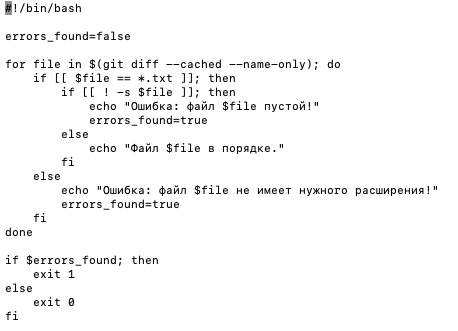
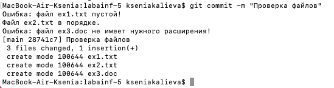
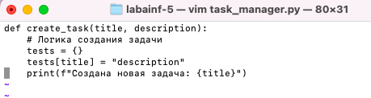
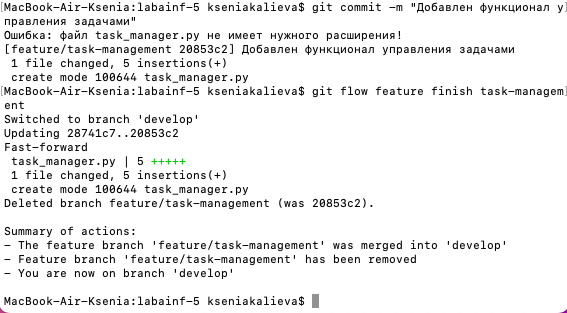
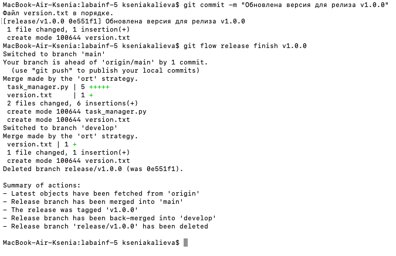
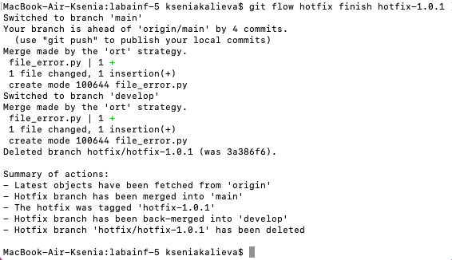

# Лабораторная работа 5

## Задание 1 - Автоматизация проверки формата файлов при коммите

- Копирую репозиторий в директорию
- Перехожу в директорию hooks с помощью `cd .git/hooks`
- Создаю bash-скрипт внутри файла pre-commit, который будет выполнять проверку того, что коммитится файл формата .txt и в файле присутствует какой-то текст:



Подробнее о коде проверки:


Теперь данный скрипт готов к работе при коммитах. Также разрешила доступ на исполняемость `chmod +x pre-commit`

Создаю несколько файлов для проверки корректности работы Хука:

`ex1.txt` - оставляю пустым

`ex2.txt` - пишу внутрь файла какой-то текст

`ex3.doc` - файл другого расширения

Далее делаю коммит измененных файлов
```
git add ex1.txt ex2.txt ex3.doc
git commit -m "Проверка файлов"
```

и скрипт выводит информацию сразу для всех файлов



## Задание 2 - Использование Git Flow в проекте

1. Установила Git Flow через терминал:

```
brew install git-flow
```

2. В корне репозитория выполнила инициализацию Git Flow.

```
git flow init
```

3. Создаю ветку для новой функциональности "task-management":

```
git flow feature start task-management
```

4. Внесла изменения в код для добавления функционала управления задачами ( для этого создала файл task_manager.py):



5. Выполнила изменения по мере разработки:

```
git add task_manager.py
git commit -m "Добавлен функционал управления задачами"
```


6. После завершения разработки функции завершила фичу и объединила ее с основной веткой:

```
git flow feature finish task-management
```


Git Flow автоматически удалил ветку feature/task-management и переключился на ветку develop:


7. Начнала создание релиза:

```
git flow release start v1.0.0
```

8. Внесла изменения, связанные с релизом (обновила версию в файле version.txt):

```
echo "v1.0.0" > version.txt
git add version.txt
git commit -m "Обновлена версия для релиза v1.0.0"

```

9. Завершила релиз и объединила его с ветками "develop" и "main":

```
git flow release finish v1.0.0
```


10. Создала hotfix:

```
git flow hotfix start hotfix-1.0.1
```

11. Внесла изменения для исправления ошибки и коммитите:

В файле `file_error.py` прописала:

```
print(f"File with errors")
```

Далее коммит
```
git add file_with_error.py
git commit -m "Исправлена критическая ошибка"
```

12. Завершила hotfix и объединила его с ветками "develop" и "main":

```
git flow hotfix finish hotfix-1.0.1
```


```
git push origin develop
git push origin main

```
### Как успешно сдать работу?

Что вам нужно знать, чтобы успешно защитить работу:

Основные команды Git, как возникают и как решать конфликты, Git Hooks, Git Flow. 

## Ресурсы

1. [Git Documentation](https://git-scm.com/doc)
2. [Atlassian Git Tutorial](https://www.atlassian.com/git/tutorials)
3. [Pro Git Book](https://git-scm.com/book/en/v2)
4. [Markdown Guidelines](https://docs.github.com/ru/get-started/writing-on-github/getting-started-with-writing-and-formatting-on-github/basic-writing-and-formatting-syntax)
